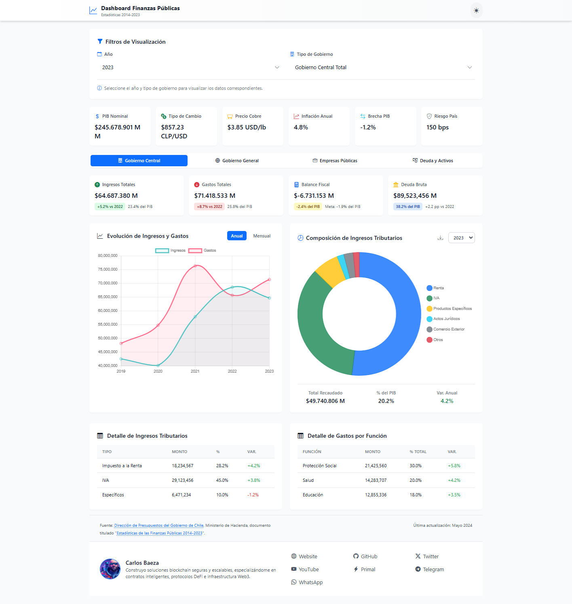
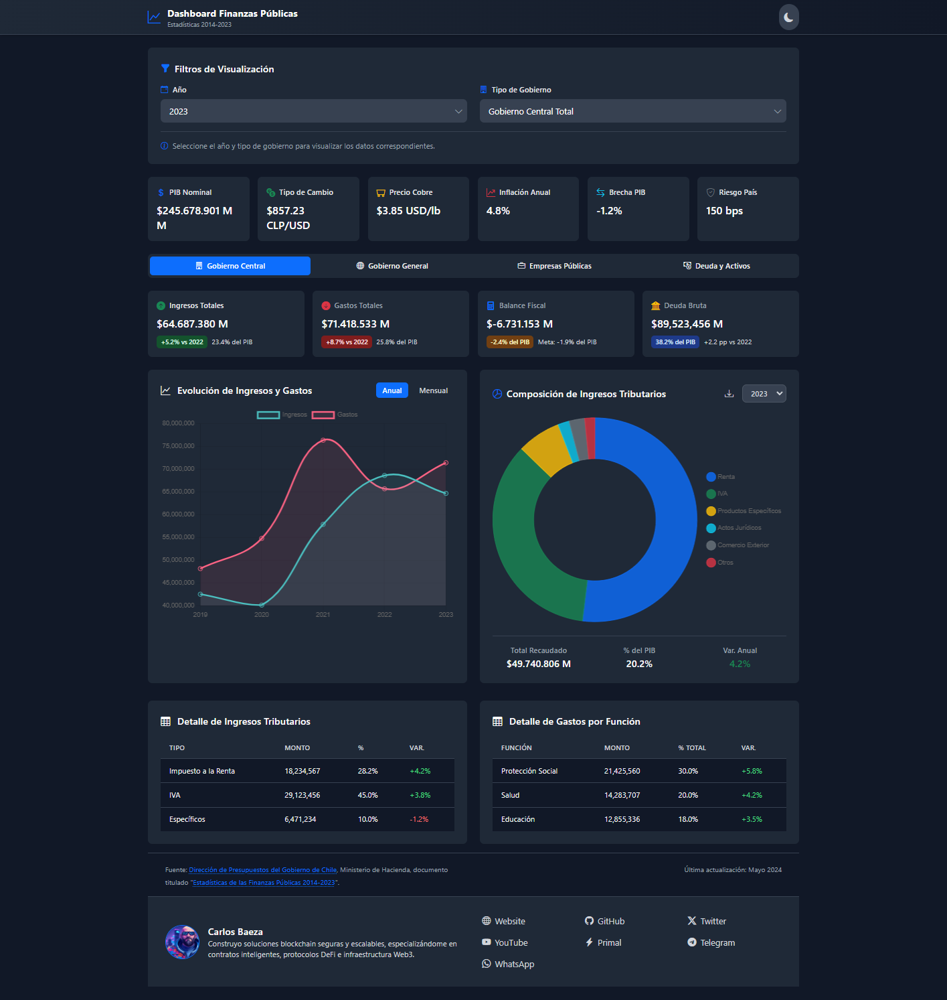

# Dashboard de Finanzas Públicas de Chile

## Descripción General
Este dashboard interactivo proporciona una visión integral de las finanzas públicas de Chile, abarcando el período 2014-2023. Diseñado para satisfacer las necesidades tanto de economistas y analistas financieros como de usuarios interesados en comprender la situación fiscal del país.

## Ventajas desde la Perspectiva Económica

### 1. Visión Integral de la Política Fiscal
- **Análisis Multidimensional**: Integra indicadores macroeconómicos, fiscales y estructurales en una única plataforma
- **Seguimiento de Metas**: Permite evaluar el cumplimiento de objetivos fiscales y comparar con metas establecidas
- **Análisis Temporal**: Facilita la identificación de tendencias y patrones en las variables fiscales

### 2. Indicadores Clave
- **Sostenibilidad Fiscal**: 
  - Proyecciones de deuda/PIB
  - Balance primario
  - Costo promedio de la deuda
  - Multiplicador fiscal
- **Análisis Estructural**:
  - Brecha del PIB
  - Precio de referencia del cobre
  - Elasticidades fiscales
  - Balance estructural vs efectivo

### 3. Desagregación por Niveles de Gobierno
- Gobierno Central (Presupuestario y Extrapresupuestario)
- Gobierno General
- Empresas Públicas
- Sector Municipal

### 4. Análisis de Riesgos
- Pasivos contingentes
- Exposición cambiaria
- Riesgos pensionales
- Sensibilidad a variables clave

## Ventajas desde la Perspectiva Técnica

### 1. Arquitectura Moderna
- Desarrollado con tecnologías web estándar (HTML5, CSS3, JavaScript)
- Utiliza Bootstrap 5 para un diseño responsivo
- Implementa Chart.js para visualizaciones dinámicas
- Optimizado para rendimiento y usabilidad

### 2. Características Técnicas
- **Interactividad**: Filtros dinámicos por año y tipo de gobierno
- **Visualización**: Múltiples tipos de gráficos adaptados a cada tipo de dato
- **Responsividad**: Adaptable a diferentes dispositivos y tamaños de pantalla
- **Modularidad**: Código organizado y mantenible

### 3. Capacidades de Análisis
- Cálculos automáticos de variaciones
- Formateo inteligente de números y monedas
- Actualización en tiempo real de indicadores
- Manejo eficiente de datos históricos

## Guía de Uso

### 1. Navegación Principal
- **Filtros Superiores**: 
  - Selector de año (2014-2023)
  - Tipo de gobierno (Total, Presupuestario, Extrapresupuestario)
- **Pestañas Principales**:
  - Gobierno Central
  - Gobierno General
  - Empresas Públicas
  - Deuda y Activos

### 2. Análisis Recomendados

#### Análisis de Sostenibilidad
1. Revisar la evolución de la deuda bruta y neta
2. Analizar el balance primario y sus componentes
3. Evaluar las proyecciones de deuda/PIB
4. Examinar el costo y estructura de la deuda

#### Análisis de Desempeño Fiscal
1. Comparar ingresos y gastos efectivos
2. Evaluar la composición de ingresos tributarios
3. Analizar la clasificación funcional del gasto
4. Revisar indicadores de eficiencia del gasto

#### Análisis de Riesgos
1. Monitorear pasivos contingentes
2. Evaluar exposición cambiaria
3. Analizar sensibilidad a precios de materias primas
4. Revisar riesgos pensionales

### 3. Interpretación de Datos

#### Indicadores de Tendencia
- **Flechas Verdes**: Indican mejora según la naturaleza del indicador
- **Flechas Rojas**: Indican deterioro según la naturaleza del indicador
- **Variaciones Porcentuales**: Muestran cambios respecto al año anterior

#### Comparaciones
- **vs PIB**: Permite evaluar el tamaño relativo de variables
- **vs Año Anterior**: Muestra la evolución temporal
- **vs Metas**: Indica el cumplimiento de objetivos

## Casos de Uso

### 1. Análisis de Política Fiscal
- Evaluación de la postura fiscal
- Análisis de multiplicadores fiscales
- Seguimiento de reglas fiscales
- Evaluación de sostenibilidad

### 2. Investigación Económica
- Análisis de series temporales
- Estudios de política económica
- Evaluación de impacto de medidas
- Proyecciones fiscales

### 3. Toma de Decisiones
- Planificación presupuestaria
- Gestión de deuda pública
- Evaluación de riesgos fiscales
- Diseño de políticas públicas

## Recomendaciones de Uso

### 1. Para Análisis Regular
- Comenzar con los indicadores de cabecera
- Revisar variaciones significativas
- Analizar tendencias en gráficos principales
- Examinar desagregaciones relevantes

### 2. Para Análisis Profundo
- Utilizar datos históricos completos
- Combinar múltiples indicadores
- Analizar correlaciones entre variables
- Examinar descomposiciones detalladas

### 3. Para Presentaciones
- Utilizar gráficos más relevantes
- Destacar tendencias principales
- Focalizarse en mensajes clave
- Aprovechar visualizaciones interactivas

## Notas Técnicas
- Actualización mensual de datos
- Fuente: Dirección de Presupuestos, Ministerio de Hacienda
- Metodología consistente con estándares internacionales
- Definiciones alineadas con el Manual de Estadísticas Fiscales del FMI

## Contacto y Soporte
Para consultas técnicas o metodológicas, contactar a:
[Información de contacto del equipo de soporte] 